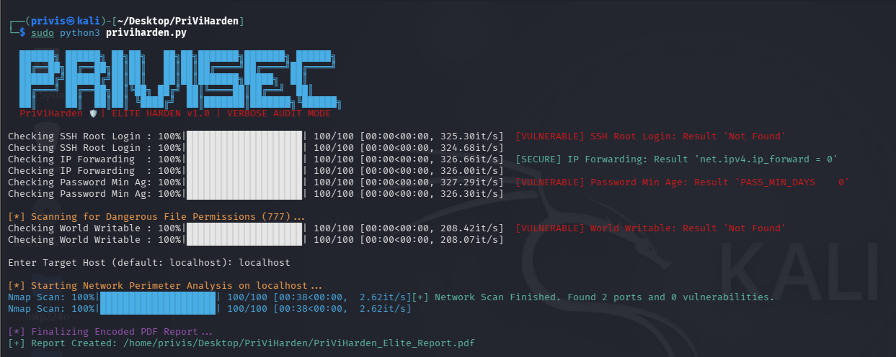

<div align="center">

# 🛡️ PriViHarden Linux Vulnerability Auditor v2.0: Developed by PriViSecurity



</div>

### Linux Hardening & Security Configuration Auditor
**Developed by Prince Ubebe | [PriViSecurity](https://github.com/Privis40)**

---

## ⚠️ Legal Notice

> **This tool audits the local system's security configuration. It must be run on systems you own or have explicit written authorization to audit.**
> PriViSecurity accepts no liability for unauthorized use.

---

## What It Does

PriViHarden is a comprehensive Linux security configuration auditor. It runs **23 read-only checks** across six security domains — SSH configuration, kernel hardening, password policy, file system security, services and firewall, and logging — then scores the system out of 100, displays findings in a Rich terminal dashboard, and generates a branded PDF audit report.

It is designed for:
- System administrators auditing server hardening before production deployment
- Penetration testers performing pre-engagement baseline assessments
- Security teams running periodic compliance checks on Linux infrastructure
- Students and researchers studying Linux hardening in lab environments

---

## Features

| Feature | Description |
|---|---|
| 🔐 SSH Configuration (4 checks) | Root login, password auth, MaxAuthTries, protocol version |
| ⚙️ Kernel Hardening (5 checks) | IP forwarding, ICMP redirects, SYN cookies, ASLR, core dumps |
| 🔑 Password Policy (4 checks) | Min/max age, complexity (pam_pwquality), empty passwords |
| 📁 File System Security (4 checks) | World-writable files, SUID binaries, /etc/passwd, /etc/shadow |
| 🛡️ Services & Firewall (4 checks) | UFW/iptables, Telnet, rsh/rlogin, cron permissions |
| 📋 Logging & Auditing (2 checks) | auditd, rsyslog/syslog |
| 📊 Risk Scoring | 0–100 score with A/B/C/D grade |
| 📄 Branded PDF Report | Full findings, score bar, and remediation recommendations |
| ✅ Read-Only | Zero changes made to the system — audit only |

---

## Requirements

```bash
pip install rich fpdf2
```

---

## Installation

```bash
git clone https://github.com/Privis40/PriViHarden_Linux-Vulnerability-Auditor.git
cd PriViHarden_Linux-Vulnerability-Auditor
pip install -r requirements.txt
```

---

## Usage

```bash
sudo python3 priviharden.py
```

Root is required to read system configuration files (`/etc/shadow`, sysctl values, service states).

The tool will:
1. Display target system info (hostname, kernel, distro)
2. Run all 23 checks with a progress bar
3. Display results grouped by category in Rich tables
4. List remediation recommendations for all failed checks
5. Save a branded PDF report

### Example Output

```
  Hostname:      prod-server-01
  Kernel:        6.1.0-21-amd64
  Distribution:  Debian GNU/Linux 12 (bookworm)
  Audit Date:    2026-05-11 14:30:22

[*] Starting 23-check security audit...

  SSH Configuration
  ┌──────────────────────────┬────────────┬──────┬─────────────────────────────┐
  │ Check                    │ Status     │ -Pts │ Detail                      │
  ├──────────────────────────┼────────────┼──────┼─────────────────────────────┤
  │ SSH Root Login           │ SECURE     │ 0    │ PermitRootLogin disabled     │
  │ SSH Password Auth        │ VULNERABLE │ 12   │ Password auth enabled        │
  │ SSH MaxAuthTries         │ WARNING    │ 5    │ MaxAuthTries = 6             │
  │ SSH Protocol Version     │ SECURE     │ 0    │ SSHv2 only                  │
  └──────────────────────────┴────────────┴──────┴─────────────────────────────┘

  Security Score:  74/100
  Grade:           B — MODERATE RISK

[+] Report saved: PriViHarden_Audit_prod-server-01_20260511_143022.pdf
```

---

## Check Categories

### SSH Configuration
Audits `/etc/ssh/sshd_config` for root login, password authentication, MaxAuthTries, and protocol version settings.

### Kernel Hardening
Inspects sysctl parameters for IP forwarding, ICMP redirect acceptance, SYN cookie protection, ASLR level, and core dump configuration.

### Password Policy
Reads `/etc/login.defs` for password age enforcement, checks `/etc/security/pwquality.conf` and PAM for complexity requirements, and scans `/etc/shadow` for empty passwords.

### File System Security
Searches for world-writable files and unexpected SUID binaries system-wide, and verifies `/etc/passwd` and `/etc/shadow` permissions.

### Services & Firewall
Checks UFW and iptables for active firewall rules, detects Telnet and rsh/rlogin installation, and audits cron directory permissions.

### Logging & Auditing
Verifies auditd and syslog daemon are active for system-level event capture.

---

## Scoring System

| Score | Grade | Risk Level |
|---|---|---|
| 85 – 100 | A | Low Risk |
| 70 – 84 | B | Moderate Risk |
| 50 – 69 | C | High Risk |
| 0 – 49 | D | Critical Risk |

Vulnerable findings deduct their full point value. Warnings deduct half.

---

## PDF Report Sections

1. Audit Summary (host, date, score, grade, stats)
2. SSH Configuration findings
3. Kernel Hardening findings
4. Password Policy findings
5. File System Security findings
6. Services & Firewall findings
7. Logging & Auditing findings
8. Remediation Recommendations
9. Legal & Scope Declaration

---

## What This Tool Does NOT Do

- ❌ Does **not** modify any system configuration
- ❌ Does **not** install, remove, or change any files
- ❌ Does **not** attempt authentication against any service
- ❌ Does **not** transmit data externally

Every check is **read-only**.

---

## Tested On

- Kali Linux 2024+
- Ubuntu 22.04 / 24.04
- Debian 11 / 12
- Python 3.10+

---

## Author & Brand

**Prince Ubebe**
Cybersecurity Analyst | Security Automation Engineer | Founder, PriViSecurity

- GitHub: [github.com/Privis40](https://github.com/Privis40)
- LinkedIn: [linkedin.com/in/prince-ubebe-291573321](https://www.linkedin.com/in/prince-ubebe-291573321)
- YouTube: [@princeubebecyber](https://youtube.com/@princeubebecyber)
- HackerOne / Bugcrowd: Active researcher

---

## License

This tool is released for **authorized security research and professional use only.**
Redistribution or modification for malicious purposes is strictly prohibited.

© 2026 PriViSecurity. All rights reserved.
